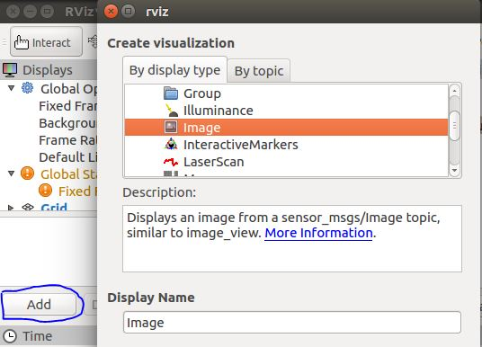
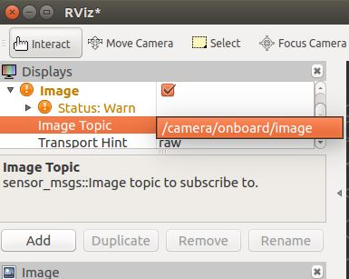

# JetsonOnboardCamera
A camera package for ROS, the target is jetson tx2(it should work on jetson tx1) 

## Prerequisites
1. ROS Kinetic
2. CMake(mine is 3.11)
3. OpenCV(mine is 3.4.1, I don't know why the built-in opencv from Jetpack 3.2 doesn't work for me.)
   Follow this link to install OpenCV on jetson tx2: https://jkjung-avt.github.io/opencv3-on-tx2/

## Build
```
# Sync the repo.
$ git clone https://github.com/Dengjianping/JetsonOnboardCamera.git

$ cd JetsonOnboardCamera
$ catkin_make # just seconds

# add current project to env
$ source ./devel/setup.bash
```

## Usage
Tips: the topic is ```/camera/onboard/image```.

### launch the node
Make sure the node is launched smoothly.
```
# use default configuration, width = 1280, height = 720, fps = 30
$ roslaunch onboard_camera onboard_camera.launch

# or specified configuration, example
$ roslaunch onboard_camera onboard_camera.launch width:=1920 height:=1080 fps:=15
```

#### rviz
1. Open rviz.
```
$ rosrun rviz rviz
```
2. Add image to rviz.

   
3. Choose topic. The video stream will be showed at the left-bottom of rviz.
   


#### image_view
```
$ rosrun image_view image_view image:=/camera/onboard/image
```

## To-do
1. [Camera Calibration](http://wiki.ros.org/camera_calibration/Tutorials/MonocularCalibration) (looks easy)
2. Add camera instead of image in rviz. (it need calibrate the camera to generate a camera info file, maybe someone would take a try)